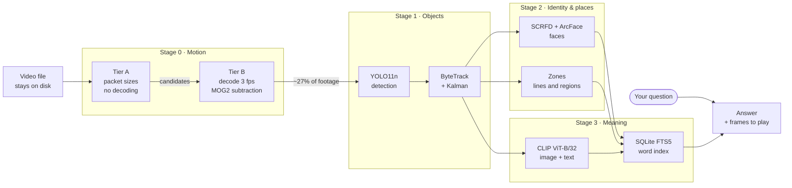
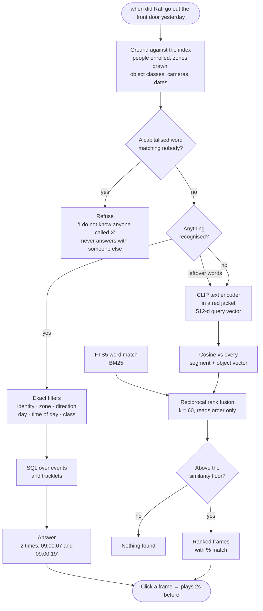
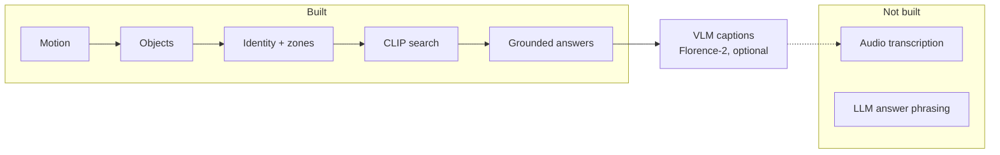
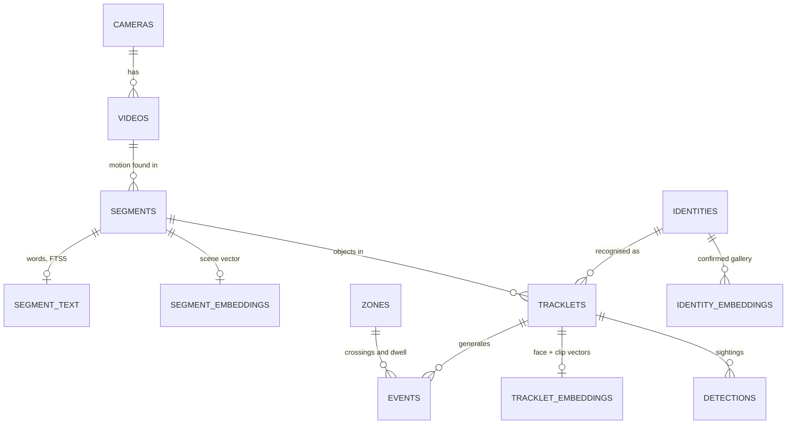

# How TextSearchVDO works

Every diagram here renders on GitHub. Everything described runs on the user's
own machine; no footage or query leaves the device.

**Short answer to "which LLM?": there is no language model.** Question parsing
is ordinary code, not an LLM. There *is* one vision-language model — Florence-2
— but it is optional and off by default, because describing one image takes
about six seconds on a CPU. [What it adds, and what it costs.](#is-there-an-llm-or-a-vlm)

---

## Getting it running

```bash
python -m tsv setup
```

That fetches or builds all four model sets, skipping whatever is present. It
is the only step needing the internet.

Two of the four have to be *built* rather than downloaded — Ultralytics
publishes YOLO11 only as PyTorch checkpoints, and the CLIP ONNX on the hub is
one fused graph rather than the separate image and text encoders used here — so
setup creates a throwaway environment carrying torch, uses it, and leaves the
running application without it. At inference this is ONNX Runtime and numpy,
which is what makes it small enough to hand to somebody else.

| Component | Size | Without it |
|---|---:|---|
| Object detection | 11 MB | a video is only motion; no objects, people or search |
| Face recognition | 16 MB | people cannot be named |
| Semantic search | 605 MB | search by description is unavailable; words still work |
| Descriptions | 275 MB | no captions, so actions are not searchable |

Only the detector is really required. Everything else degrades to less of the
app rather than a broken one, and the app says which parts are absent instead
of failing at the moment they would have been used.

---

## At a glance

The whole design is a cascade: each stage is more expensive than the last, so
each one only ever sees what the cheaper stage before it kept. Security
footage is 90–97% nothing happening, and nothing expensive should ever look at
that part.



Stage 0 keeps roughly a quarter of a recording on the test clips, and far less
on real overnight footage. Everything downstream is paid for only on what
survives.

---

## What happens when you add a video

One drop, three passes, no video re-read between them.


### Why it is split this way

| Decision | Reason |
|---|---|
| Tier A never decodes | Demuxing is disk-bound; decoding is CPU-bound. Triaging a night of footage costs seconds. |
| Score is **bytes per P-frame, per GOP position** | A P-frame's cost depends on its distance from the last keyframe. Raw sizes carry a periodic swing larger than a walking person. |
| All-intra detected **per bin**, not per file | Encoders emit nothing but keyframes when a scene gets noisy. Such a stretch has no motion signal, and scoring it reads as "idle" — silently losing whatever happened. |
| Idle floor is a **low quantile**, not the median | Motion only pushes bins upward. On a short file where someone is on screen half the time, the median sits inside the activity and hides it. Many NVRs write one-minute files. |
| Faces from the **best 5 crops**, not every frame | The face stack would otherwise cost more than the detector that found the person. |
| Zone events use **stored boxes**, never video | Zones get redrawn constantly. Moving a door line must not mean re-running the detector over a week of footage. |

---

## What happens when you type



Three signals, kept apart because they fail in different places:

- **Exact filters** are constraints, not ranking. This is what makes *when did
  Rafi go out the front door* precise rather than merely likely.
- **Lexical** finds what is *named* right — an object class, an enrolled
  person, a drawn zone. Exact where it applies, silent where it does not.
- **Semantic** finds what *looks* right — clothing, posture, scene. It cannot
  tell you anybody's name.

They are fused by rank, not by score: a cosine similarity and a BM25 score
share no scale, and normalising them would need recalibrating whenever either
model changed.

---

## The models

| Model | File | Size | Job | Runs on |
|---|---|---:|---|---|
| **YOLO11n** | `yolo11n.onnx` | 10.7 MB | Find objects — people, vehicles, animals, bags | Intel iGPU |
| **SCRFD** `det_500m` | `det_500m.onnx` | 2.5 MB | Find faces and their 5 landmarks | CPU |
| **ArcFace** `w600k_mbf` | `w600k_mbf.onnx` | 13.6 MB | 512-d face vector for identity | CPU |
| **CLIP ViT-B/32** image | `clip_image.onnx` | 351 MB | Turn frames and crops into meaning vectors | CPU |
| **CLIP ViT-B/32** text | `clip_text.onnx` | 254 MB | Turn your words into the same space | CPU |
| **Florence-2-base-ft** | `florence2/` (4 graphs) | 275 MB | Describe what a person is doing | CPU |

Provenance, and how each is obtained:

| Model | Comes from | Fetched by |
|---|---|---|
| YOLO11n | Ultralytics checkpoint, exported to ONNX | `tools/export_model.py` |
| SCRFD + ArcFace | InsightFace `buffalo_s` pack | `tools/fetch_face_models.py` |
| CLIP | `openai/clip-vit-base-patch32` via transformers | `tools/export_clip.py` |
| Florence-2 | `onnx-community/Florence-2-base-ft`, int8 | `tools/fetch_caption_model.py` |

**None of these are runtime dependencies.** `torch`, `ultralytics`,
`transformers` and `insightface` are used once, from a throwaway
`.venv-export`, purely to produce the ONNX files. At runtime the app is ONNX
Runtime plus numpy — which is what keeps it small enough to ship to someone
who just wants to search their own cameras.

CLIP's tokenizer is re-implemented in pure Python for the same reason. Its
equivalence is proven rather than assumed: the export dumps the reference
vocabulary and reference token ids, and the tests assert an exact match on all
49,408 vocabulary entries.

### Where each model runs, and why it differs

The best backend is a property of the **model**, not the machine. Measured per
forward pass on the baseline laptop — i5-1235U with Intel UHD graphics, no
discrete GPU:

| Model | Intel iGPU | CPU | Winner |
|---|---:|---:|---|
| YOLO11n @ 640 | **33 ms** | 45 ms | iGPU |
| SCRFD det_500m @ 640 | 54 ms | **24 ms** | CPU |
| ArcFace @ 112 | 24 ms | **9 ms** | CPU |
| CLIP image @ 224 | 82 ms | **51 ms** | CPU |
| CLIP text @ 77 tokens | 34 ms | 36 ms | a wash |

Captioning is measured differently because it is a different shape of work:

| Florence-2 stage | CPU |
|---|---:|
| Vision encoder @ 768px | **6.07 s** |
| Text encoder | 0.22 s |
| Decoding | 25 ms per token |

Almost the whole cost is encoding the image, and it is paid once per image
regardless of how much text comes back. That decides the design: **describe a
tracklet once, never a frame**, and ask for the longest description available,
because length is nearly free.

It is not about model size — CLIP's image encoder is by far the largest graph
here and still loses on the iGPU. Only a sustained, convolution-heavy workload
keeps that GPU busy enough to pay back the cost of moving data to it. Compile
time compounds it: the iGPU takes 4–6 seconds to compile a graph the CPU loads
in half a second, which a user feels on their first search.

So the detector runs on the iGPU while the face and CLIP stacks run on the
CPU — in the same pass, chosen per model.

---

## Is there an LLM or a VLM?

**No language model. One optional vision-language model.**

Nothing generates prose answers, and no chat model is involved. Question
parsing is ordinary code, described below.

**Florence-2-base-ft does generate text** - one description per tracked
person, written into the index so it can be searched by word. It is off by
default and enabled per run, because six seconds an image means a day of
footage with a few hundred people in it is the better part of an hour. That is
a background job somebody chooses, not something to make them wait through.

Its value is words that no other stage can produce. Detection knows a person
is there; identity knows who; zones know where. Only a caption can say *red
bag*, *pink shirt*, or *medicine bottle* - and once it does, those become
ordinary search terms.

**Question understanding is entity grounding, not language understanding.**
The vocabulary a question can draw on is closed and already in the database:
the people you enrolled, the zones you drew, the classes the detector knows,
the cameras you have, and dates. Matching against that is reliable in a way
that parsing arbitrary English is not, and it costs nothing to run. Whatever
is left after the known entities are lifted out becomes the CLIP query, which
handles the genuinely open-vocabulary half.

The limitation is honest: the direction phrases — *went out*, *came home* — are
a **fixed list**, not an understanding of English. Real use will throw up
phrasings that need adding.

### What a VLM would add, and what it would cost

A vision-language model captioning person crops is the missing piece for
questions about *fine-grained actions* — the *"when did father take his
medicine"* class. That needs a model that can look at a person and describe
what they are doing, which none of the five above can.

It is not built. Both halves are viable on this Python without adding a torch
runtime dependency — `faster-whisper` via ctranslate2 for audio, and
`onnxruntime-genai` for generation — but on a CPU-only machine captioning a
day of footage is an overnight batch, not something to run while you wait.



---

## What gets stored

SQLite, schema version 5. One file, no server.



Boxes are stored normalised 0–1, so they survive a camera being reconfigured
to a different resolution. Zone geometry is stored the same way.

---

## Numbers

Measured on the baseline laptop, no discrete GPU:

| | |
|---|---|
| Stage 0 throughput | 35–140× realtime |
| A 24-hour recording, motion pass | roughly 10 minutes |
| Detection | ~15 frames/second |
| An 8-minute phone video, end to end | ~40 seconds |
| Captioning, per tracked person | ~5.5 seconds |
| Footage discarded before detection | ~73% on test clips |

## Every threshold is still a guess

None of this has been calibrated against real cameras. The thresholds live in
`tsv/config.py`, grouped by stage, and the ones most likely to need moving are
listed under *Before trusting this on real footage* in the
[README](../README.md).
