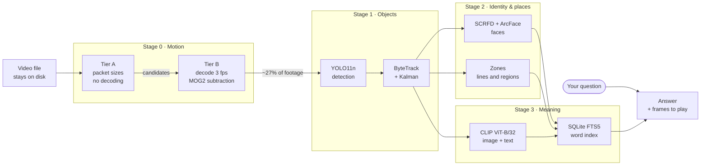
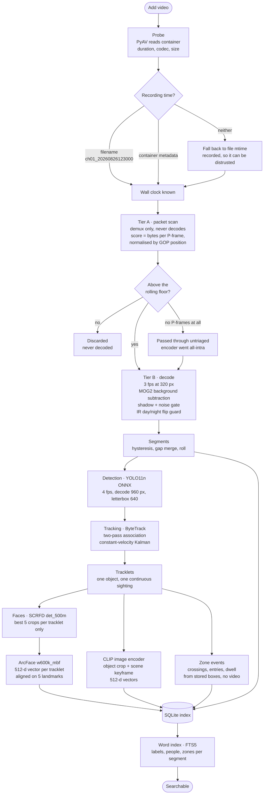
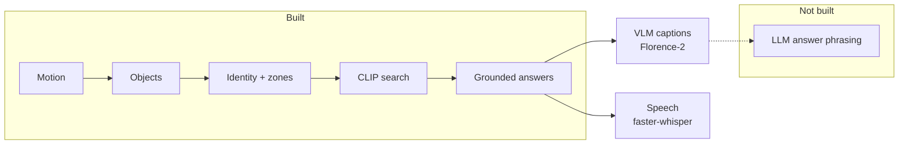
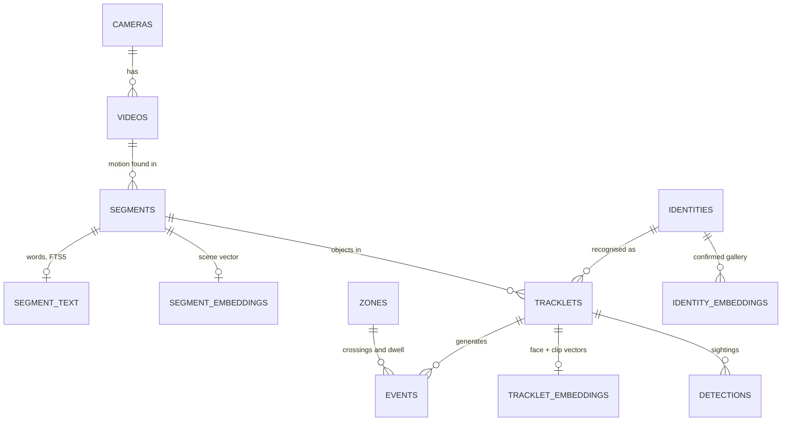

# How TextSearchVDO works

Every diagram here renders on GitHub. Everything described runs on the user's
own machine; no footage or query leaves the device.

**Short answer to "which LLM?": there is no language model.** Question parsing
is ordinary code, not an LLM. There *is* one vision-language model — Florence-2
— which runs as the last stage of an import when its weights are installed,
and costs about six seconds an image.
[What it adds, and what it costs.](#is-there-an-llm-or-a-vlm)

---

## Getting it running

```bash
python -m tsv setup
```

That fetches or builds all four model sets, skipping whatever is present. It
is the only step needing the internet.

Two of the four have to be *built* rather than downloaded — Ultralytics
publishes YOLO11 only as PyTorch checkpoints, and the CLIP ONNX on the hub is
one fused graph rather than the separate image and text encoders used here — so
setup creates a throwaway environment carrying torch, uses it, and leaves the
running application without it. At inference this is ONNX Runtime and numpy,
which is what makes it small enough to hand to somebody else.

| Component | Size | Without it |
|---|---:|---|
| Object detection | 11 MB | a video is only motion; no objects, people or search |
| Face recognition | 16 MB | people cannot be named |
| Semantic search | 605 MB | search by description is unavailable; words still work |
| Descriptions | 275 MB | no captions, so actions are not searchable |

Only the detector is really required. Everything else degrades to less of the
app rather than a broken one, and the app says which parts are absent instead
of failing at the moment they would have been used.

---

## At a glance

The whole design is a cascade: each stage is more expensive than the last, so
each one only ever sees what the cheaper stage before it kept. Security
footage is 90–97% nothing happening, and nothing expensive should ever look at
that part.



Stage 0 keeps roughly a quarter of a recording on the test clips, and far less
on real overnight footage. Everything downstream is paid for only on what
survives.

---

## What happens when you add a video

One drop, three passes, no video re-read between them.



### Why it is split this way

| Decision | Reason |
|---|---|
| Tier A never decodes | Demuxing is disk-bound; decoding is CPU-bound. Triaging a night of footage costs seconds. |
| Score is **bytes per P-frame, per GOP position** | A P-frame's cost depends on its distance from the last keyframe. Raw sizes carry a periodic swing larger than a walking person. |
| All-intra detected **per bin**, not per file | Encoders emit nothing but keyframes when a scene gets noisy. Such a stretch has no motion signal, and scoring it reads as "idle" — silently losing whatever happened. |
| Idle floor is a **low quantile**, not the median | Motion only pushes bins upward. On a short file where someone is on screen half the time, the median sits inside the activity and hides it. Many NVRs write one-minute files. |
| Faces from the **best 5 crops**, not every frame | The face stack would otherwise cost more than the detector that found the person. |
| Zone events use **stored boxes**, never video | Zones get redrawn constantly. Moving a door line must not mean re-running the detector over a week of footage. |

---

## What happens when you type


### Drawing the places a question can be about

A direction is not a property of a video, it is a property of a line somebody
drew. `zones.py` calls a crossing `cross_in` when `side_of_line(end, a, b)` is
positive — left of the line as drawn — so *which way round you draw it* is
what makes *went out* mean going out. The editor draws that side as an arrow
before you save, because it is otherwise a coin toss discovered days later in
a wrong answer about your own front door.

Events cost no video decoding: they are recomputed from the boxes already
stored, so a line drawn now has a crossing count immediately. That count is
the honest test of whether it is anywhere useful — zero means redraw it, not
wait.

### Which face models, and the licence that decides it

InsightFace's SCRFD + ArcFace are published for **non-commercial research**,
which made them the last licence blocker before this could be sold. The
replacement is OpenCV's own pair — **YuNet (MIT)** for detection and **SFace
(Apache-2.0)** for recognition — and since OpenCV is already a dependency,
switching installs nothing new.

```bash
python tools/fetch_face_models_permissive.py --out data/models
```

It buys no accuracy, and that is the result to want. Over 98 person crops from
real footage SCRFD found a face in 20.4% and YuNet in 18.4%, median 17–21
pixels either way — indistinguishable at that sample size. The swap costs
nothing and removes the restriction.

What could **not** be validated is recognition, and the reason matters more
than the models. Splitting SFace's ability to tell people apart by face size:

| faces measured | same person | different people | separation |
|---|---:|---:|---:|
| all (median 18px) | 0.306 | 0.306 | **+0.000** |
| ≥ 30px | 0.646 | 0.215 | +0.431 |

At the sizes this footage contains there is no separation at all — same-person
and different-person pairs score identically, so any threshold names strangers
as often as the right person. The ≥ 30px row rests on a single same-person
pair and indicates rather than proves. Either way the limit is the **camera,
not the model**: recognition wants roughly 112 pixels of face, and 18 pixels
upscaled has no identity left to recover. ArcFace does no better; on the same
footage it finds slightly more faces and they are just as small.

The practical consequence is that naming people works where a camera sees
faces at something like head height and close range, and does not work on a
wide overview shot — regardless of which models are installed.

### Naming people, and where it stops

Naming a sighting adds its face vector to that person's gallery; matching then
finds them everywhere else. One name, every appearance — that is the whole
mechanism, and a face is the only thing that carries it.

So it stops wherever the face does. A camera above head height, someone facing
away, or a wide shot where a head is twenty pixels across all produce a person
the tracker follows perfectly and a face nothing can read. The app names that
sighting and says plainly that it will not find the others, because the
alternative is promising a match that never arrives.

The tempting fix is the CLIP vector already stored for every person crop.
Measured on real footage it does not work: two crops of the same person score
a median 0.818 against each other, a person against a *bird* scores 0.805, and
the person-to-person floor is 0.683. The distributions sit on top of each
other, so there is no threshold — using it names every person in a recording
after whoever was named first. `identity.py` keeps the `body` kind wired to
nothing on purpose, with room for a real re-identification model.

Three signals, kept apart because they fail in different places:

- **Exact filters** are constraints, not ranking. This is what makes *when did
  Rafi go out the front door* precise rather than merely likely.
- **Lexical** finds what is *named* right — an object class, an enrolled
  person, a drawn zone. Exact where it applies, silent where it does not.
- **Semantic** finds what *looks* right — clothing, posture, scene. It cannot
  tell you anybody's name.

They are fused by rank, not by score: a cosine similarity and a BM25 score
share no scale, and normalising them would need recalibrating whenever either
model changed.

---

## The models

| Model | File | Size | Job | Runs on |
|---|---|---:|---|---|
| **YOLO11n** or **YOLOX-tiny** | `yolo11n.onnx` / `yolox_tiny.onnx` | 11–20 MB | Find objects — people, vehicles, animals, bags | Intel iGPU |
| **SCRFD** `det_500m` | `det_500m.onnx` | 2.5 MB | Find faces and their 5 landmarks | CPU |
| **ArcFace** `w600k_mbf` | `w600k_mbf.onnx` | 13.6 MB | 512-d face vector for identity | CPU |
| **CLIP ViT-B/32** image | `clip_image.onnx` | 351 MB | Turn frames and crops into meaning vectors | CPU |
| **CLIP ViT-B/32** text | `clip_text.onnx` | 254 MB | Turn your words into the same space | CPU |
| **Florence-2-base-ft** | `florence2/` (4 graphs) | 275 MB | Describe what a person is doing | CPU |

Provenance, licence, and how each is obtained:

| Model | Comes from | Licence | Fetched by |
|---|---|---|---|
| YOLO11n | Ultralytics checkpoint, exported to ONNX | **AGPL-3.0** | `tools/export_model.py` |
| YOLOX-tiny | YOLOX release, already ONNX | Apache-2.0 | `tools/fetch_detector.py` |
| SCRFD + ArcFace | InsightFace `buffalo_s` pack | **research only** | `tools/fetch_face_models.py` |
| YuNet + SFace | OpenCV Zoo, via Hugging Face | MIT + Apache-2.0 | `tools/fetch_face_models_permissive.py` |
| CLIP | `openai/clip-vit-base-patch32` via transformers | MIT | `tools/export_clip.py` |
| Florence-2 | `onnx-community/Florence-2-base-ft`, int8 | MIT | `tools/fetch_caption_model.py` |

### Choosing a detector, and why the licence decides it

Ultralytics YOLO11 is AGPL-3.0, whose obligations extend to any application
distributed with it. That makes it the single biggest obstacle to shipping
this as a product, so YOLOX — Apache-2.0 — is the alternative, and it needs no
export step at all because its ONNX graphs are published directly.

The two agree closely. On one real frame both found the same person in the
same box to within a few pixels, at 0.918 and 0.880. Over a full eight-minute
recording YOLO11n produced five people and one spurious bird; YOLOX-tiny
produced seven people and no bird, twelve seconds against fourteen.

```bash
python -m tsv setup --detector yolox-tiny
```

They are not, however, interchangeable in code, and every difference between
them fails *silently*:

| | YOLO11 | YOLOX |
|---|---|---|
| Values per anchor | 84 (4 box + 80 classes) | 85 (4 box + objectness + 80 classes) |
| Channel order | RGB | **BGR** |
| Value range | 0..1 | **0..255** |
| Padding | centred | **bottom-right** |
| Box decoding | in the graph | **grid offsets and log sizes, decoded here** |
| Input size | 640 | 416 (tiny) |

Feed YOLOX a 0..1 tensor and it returns an empty frame — which looks exactly
like a frame with nothing in it, not like an error. So `models/detect.py`
holds preprocessing as a property of the *family*, picks the family from the
filename (it has to: preprocessing is chosen before the graph has run), and
then checks that guess against the real output and raises if they disagree.
The input size comes from the graph rather than from configuration, because
these exports are static and the file already knows.

`python -m tsv hardware` lists what fits this machine, what is running now,
and what blocks a sale.

**None of these are runtime dependencies.** `torch`, `ultralytics`,
`transformers` and `insightface` are used once, from a throwaway
`.venv-export`, purely to produce the ONNX files. At runtime the app is ONNX
Runtime plus numpy — which is what keeps it small enough to ship to someone
who just wants to search their own cameras.

CLIP's tokenizer is re-implemented in pure Python for the same reason. Its
equivalence is proven rather than assumed: the export dumps the reference
vocabulary and reference token ids, and the tests assert an exact match on all
49,408 vocabulary entries.

### Where each model runs, and why it differs

The best backend is a property of the **model**, not the machine. Measured per
forward pass on the baseline laptop — i5-1235U with Intel UHD graphics, no
discrete GPU:

| Model | Intel iGPU | CPU | Winner |
|---|---:|---:|---|
| YOLO11n @ 640 | **33 ms** | 45 ms | iGPU |
| SCRFD det_500m @ 640 | 54 ms | **24 ms** | CPU |
| ArcFace @ 112 | 24 ms | **9 ms** | CPU |
| CLIP image @ 224 | 82 ms | **51 ms** | CPU |
| CLIP text @ 77 tokens | 34 ms | 36 ms | a wash |

Captioning is measured differently because it is a different shape of work:

| Florence-2 stage | CPU |
|---|---:|
| Vision encoder @ 768px | **6.07 s** |
| Text encoder | 0.22 s |
| Decoding | 25 ms per token |

Almost the whole cost is encoding the image, and it is paid once per image
regardless of how much text comes back. That decides the design: **describe a
tracklet once, never a frame**, and ask for the longest description available,
because length is nearly free.

It is not about model size — CLIP's image encoder is by far the largest graph
here and still loses on the iGPU. Only a sustained, convolution-heavy workload
keeps that GPU busy enough to pay back the cost of moving data to it. Compile
time compounds it: the iGPU takes 4–6 seconds to compile a graph the CPU loads
in half a second, which a user feels on their first search.

So the detector runs on the iGPU while the face and CLIP stacks run on the
CPU — in the same pass, chosen per model.

---

## Is there an LLM or a VLM?

**No language model. One optional vision-language model.**

Nothing generates prose answers, and no chat model is involved. Question
parsing is ordinary code, described below.

**Florence-2-base-ft does generate text** - one description per tracked
person, written into the index so it can be searched by word. It runs as the
last stage of every import once its weights are present.

Six seconds an image means a night of footage with a few hundred people in it
is the better part of an hour, which is why it used to be opt-in. That was the
wrong trade: an undescribed sighting turns *carrying a bag* into an empty
screen indistinguishable from the moment not being in the video. It runs last
instead, so motion, objects, identity and semantic search are all answering
questions while it works, and the app says which of the two empty screens the
reader is looking at.

Its value is words that no other stage can produce. Detection knows a person
is there; identity knows who; zones know where. Only a caption can say *red
bag*, *pink shirt*, or *medicine bottle* - and once it does, those become
ordinary search terms.

**Question understanding is entity grounding, not language understanding.**
The vocabulary a question can draw on is closed and already in the database:
the people you enrolled, the zones you drew, the classes the detector knows,
the cameras you have, and dates. Matching against that is reliable in a way
that parsing arbitrary English is not, and it costs nothing to run. Whatever
is left after the known entities are lifted out becomes the CLIP query, which
handles the genuinely open-vocabulary half.

The limitation is honest: the direction phrases — *went out*, *came home* — are
a **fixed list**, not an understanding of English. Real use will throw up
phrasings that need adding.

### Audio, and the two gates around it

Speech is transcribed by faster-whisper on ctranslate2 — no torch, so the
runtime stays small — and the transcript joins a segment's document in the
word index alongside labels, names, zones and captions. There is no parallel
path: a spoken word fuses with the other signals like anything else.

It earns its place by carrying what the pixels do not. A doorbell, a knock,
breaking glass, an alarm, a car door outside the frame — and speech, where
*did you take your tablets* is said far more often than it is legible from a
crop.

The interesting part is what stops it inventing things. Whisper on silence
does not return nothing; it returns fluent text. Measured against the footage
this was built on, whose audio tracks are digitally silent at about
−123 dBFS:

| | result |
|---|---|
| voice-activity detection **on** | nothing, correctly |
| voice-activity detection **off** | `"Hey!"` five times, `no_speech 0.69` |

### What transcription costs, and what hardware changes it

Measured on the baseline machine (i5-1235U, int8, CPU) with the gate off, so
the whole file is genuinely decoded:

| model | size | speed | an hour of speech |
|---|---:|---:|---:|
| tiny | 78 MB | 25.0× realtime | 2.4 min |
| base | 148 MB | 17.8× realtime | 3.4 min |
| small | 486 MB | 8.0× realtime | 7.5 min |

With the gate on and real footage, base ran at **112× realtime**, because most
of a recording is silence and silence is nearly free.

The surprise is that **cores barely matter**: two threads gave 19.4× and all
twelve gave 20.6×, six percent for six times the cores. Whisper's decoder is
autoregressive, so this is not the parallel workload detection is. A bigger
CPU is the wrong thing to spend on; a discrete GPU is not, and
`audio.pick_device` takes one when it is there — `float16` on CUDA, `int8` on
CPU, falling back if a counted device will not actually load. That last part
is the same rule the backend layer lives by: listed is not usable.

So VAD is the first gate and not an optimisation. The second is the model's
own confidence: below an average log probability of −1.0, or above a
no-speech estimate of 0.6, a line is discarded — and those five fail that too.
A transcript's failure mode is not a gap, it is a plausible sentence nobody
said, and once indexed it is indistinguishable from a true one.

### What a VLM would add, and what it would cost

A vision-language model captioning person crops is the missing piece for
questions about *fine-grained actions* — the *"when did father take his
medicine"* class. That needs a model that can look at a person and describe
what they are doing, which none of the five above can.

Both halves are viable on this Python without a torch runtime dependency.
Captioning is built, above. Audio is built too, on `faster-whisper` via
ctranslate2. What remains unbuilt is an LLM phrasing the answers, and on a
CPU-only machine captioning a day of footage is still an overnight batch
rather than something to run while you wait.



---

## What gets stored

SQLite, schema version 5. One file, no server.



Boxes are stored normalised 0–1, so they survive a camera being reconfigured
to a different resolution. Zone geometry is stored the same way.

---

## Numbers

Measured on the baseline laptop, no discrete GPU:

| | |
|---|---|
| Stage 0 throughput | 35–140× realtime |
| A 24-hour recording, motion pass | roughly 10 minutes |
| Detection | ~15 frames/second |
| An 8-minute phone video, end to end | ~40 seconds |
| Captioning, per tracked person | ~5.5 seconds |
| Footage discarded before detection | ~73% on test clips |

## Every threshold is still a guess

None of this has been calibrated against real cameras. The thresholds live in
`tsv/config.py`, grouped by stage, and the ones most likely to need moving are
listed under *Before trusting this on real footage* in the
[README](../README.md).
